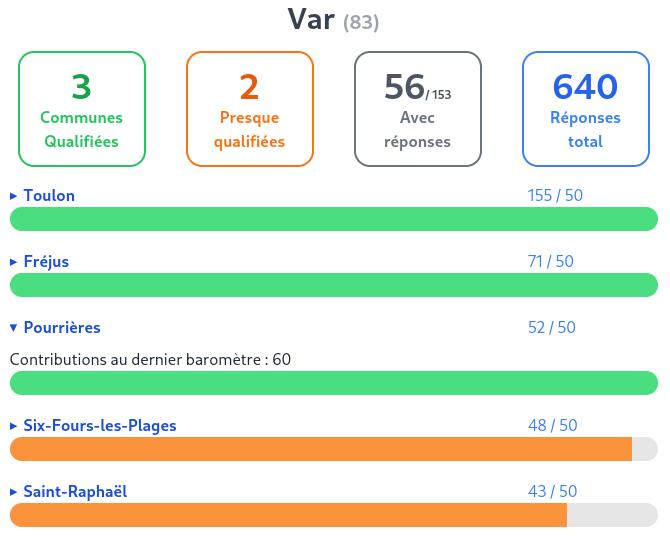

# Dashboad "Mon Baromètre"

A simple but hopefully useful dashboard for the "Baromètre Vélo" of the fub.

**Do the survey first!**
If you haven't done so yet, head on over here to fill it out.
Then you can look at dashboards. 🙂

https://www.barometre-velo.fr

This repository hosts a dashboard that's complementary to the official [map][map] that the fub provides.
You can use this dashboard hosted here:

https://barometre.toulon-var-deplacements.fr/?prefix=83

(change the prefix to your liking, or remove it for a search mask)
Here's a screenshot for the prefix `83` (the Var département):



[map]:https://www.barometre-velo.fr/dashboard.php


## Development

This code uses [Rust][rust] and [dioxus][dioxus] and is based off of the dioxus "Jumpstart" template.
It includes basic organization with an organized `assets` folder and a `components` folder.
If you chose to develop with the router feature, you will also have a `views` folder.

[rust]: https://www.rust-lang.org/
[dioxus]: https://dioxuslabs.com/

### Tailwind
1. Install npm: https://docs.npmjs.com/downloading-and-installing-node-js-and-npm
2. Install the Tailwind CSS CLI: https://tailwindcss.com/docs/installation
3. Run the following command in the root of the project to start the Tailwind CSS compiler:

```bash
npx tailwindcss@3 -i ./input.css -o ./assets/tailwind.css --watch
```

**Note** the `@3` in that command; dioxus is not currently compatible with v4 of tailwind.

### Serving Your App

Run the following command in the root of your project to start developing with the default platform:

```bash
dx serve
```

To run for a different platform, use the `--platform platform` flag. E.g.
```bash
dx serve --platform desktop
```
